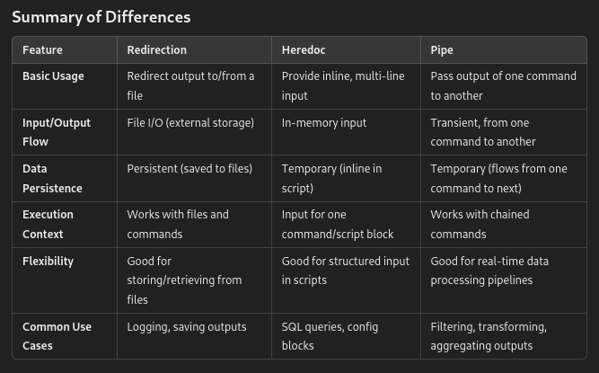

# minishell
@wichee and @apoh minihell project

## Project Outline

Only one global variable to indicate received signal.
Not interpretation of unclosed quotes or special characters such as \ (backslash) or ; (semicolon)

(0) Input(Clean) - String manipulation

(1) Lexing - Input validation, tokenization 

(2) Expansion - ENV Variables, **envp

(3) Parsing - Syntax, data structure design

(4) Redirection - heredocs and normal

.

(5) Execution - pipex, PATH variable, working history

(6) Built-Ins - echo, cd, pwd, export, unset, env, exit

(7) Signal Handling - ctrl-C, ctrl-D ctrl-\

List of Key Exit Codes in Linux

In Linux and other Unix-like operating systems, certain exit codes are widely recognized and have conventional meanings. While exit codes are often specific to individual commands or programs, some of the most common exit codes you may encounter include:

0: Success—Indicates that the command or program executed successfully without any errors.

1: General Error—A catch-all exit code for a variety of general errors. Often used when the command or program encounters an error, but no specific exit code is available for the situation.

2: Misuse of shell built-ins—Indicates incorrect usage of shell built-in commands or misuse of shell syntax.

126: Command cannot execute—The command was found, but it could not be executed, possibly due to insufficient permissions or other issues.

127: Command not found—The command was not found in the system's PATH, indicating that either the command does not exist or the PATH variable is incorrectly set.

128: Invalid exit argument—Returned when a script exits with an invalid argument. This usually indicates an error in the script itself.

128 + N: Fatal error signal N—Indicates that the command or program was terminated by a fatal error signal. For example, an exit code of 137 (128 + 9) means that the command was terminated by a SIGKILL signal.

130: Script terminated by Control-C—Indicates that the command or script was terminated by the user using Control-C (SIGINT signal).

255: Exit status out of range—Returned when the exit status is outside the valid range (0 to 254).
